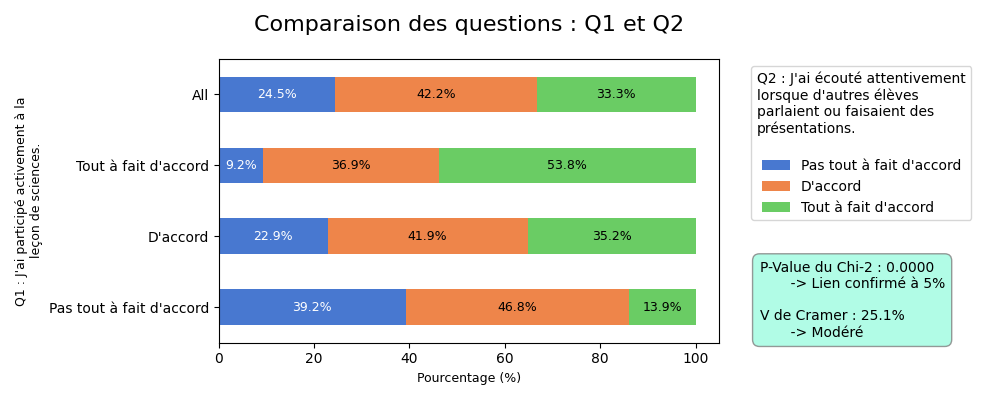
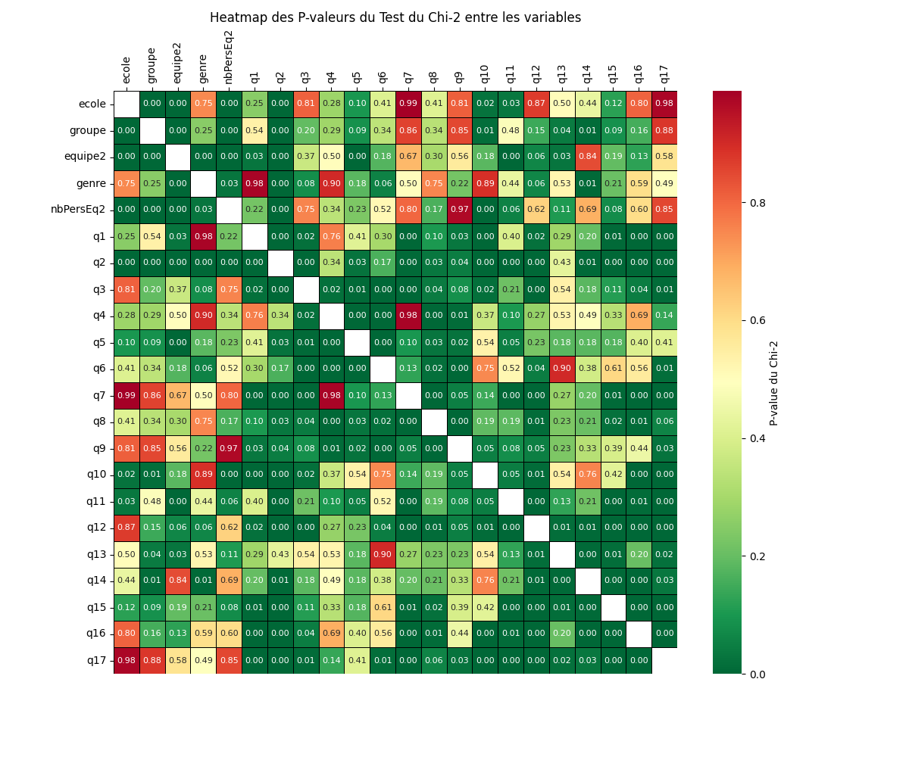
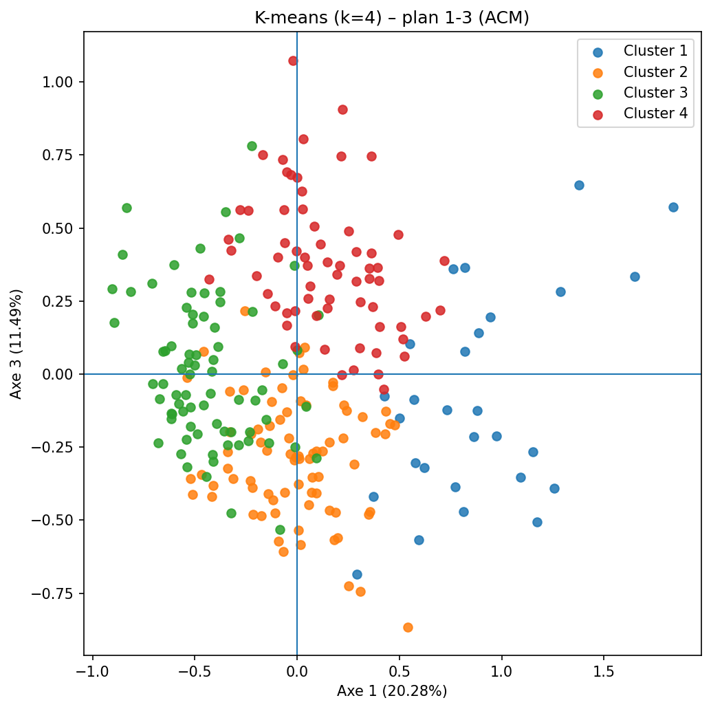
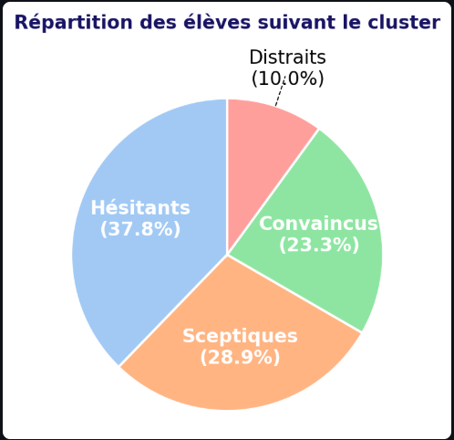
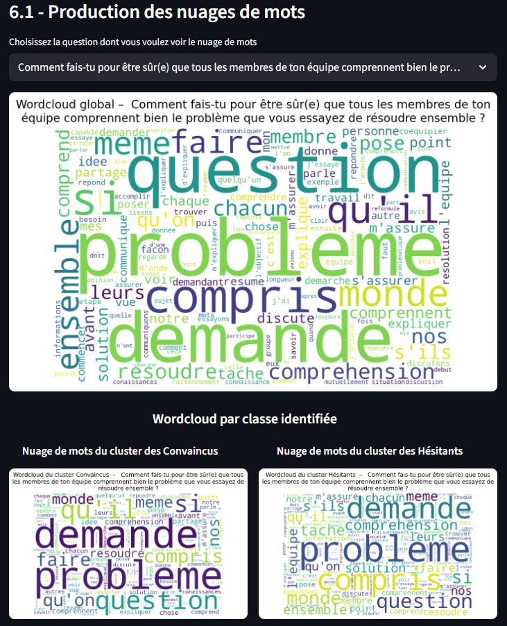

# Etude sur la collaboration
Ce projet de data science a pour objectif d'analyser la perception des élèves du secondaire 5 sur **la résolution des problèmes de science en équipes**.

L'idée est de connaître et analyser la perception de ces jeunes juste après avoir expérimenter le travail en équipe pour résoudre un problème complexe.
---
Les données analysées ici proviennent d'un questionnaire rempli par les élèves qui contient, outre quelques éléments démographiques et liés à la consitution des groupes 2 catégories de questions :
* les réponses aux question sur la base d'une échelle de linecker (de 1 à 5)
* des questions ouvertes

Les données ont été préalablement nettoyées via python afin de :
* corriger les erreurs de saisi quand c'était possible. Par exemple, le nom de l'école avait plus de 17 modalités alors qu'il n'y en a eu que 2. Ceci provient des erreurs de saisies des élèves
* imputées des variables manquantes via d'autre sources, notamment la constitution des équipes dont le fichier nous a été partagé suite à la detection du plusieurs anomaies
* L'imputation par le mode des réponses pour certaines questions avec très peu de données manquantes

Toutes ces données ont été analyser via python avant d'être mises à disposition des chercheurs pour exploitation via un site streamlit ([cliquer ici](https://etude-sur-la-collaboration-kdysrto9rw4jgddyakfr84.streamlit.app/)) entièrement développé en python.
---

## Les analyses effectuées sont les suivantes :

1. Analyses descriptives : univariées et bivariées
Parce qu'une image vaut mille mots, voici **quelques exemples d'analyses effectuées** :

Matrice des p_value des corrélation entre variables qualitatives

---
2. Analyse des correspondance multiples qui a débouchées sur une classification des élèves

**Plan factoriel 1 vs 3**

**Classe identifiées via CAH**

**Caractérisation visuelle des classes**

---
3. Analyse des réponses qualitatives via llm (*'mistral ai'* à partir de llama) et les nuages de mots
**Nuage de mots**

**Résultats des analyses de questions textuelles**

---

## Princiles lirbrairies utilisées
---
* `Pandas numpy scipy`
* `Matplotlib seaborn`
* `Prince` pour l'ACM
* `sklearn` pour la classification
* `streamlit` pour le site
* `sentence_transformers` pour le modèle llm
* `concurrent.futures` pour paralléliser les traitements

# Auteur
---
## Jules Fokou
### hervefokou@gmail.com

